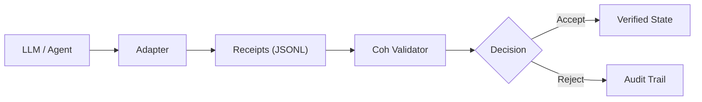

# Coh Validator

[](https://www.rust-lang.org/)
[](#)
[](#)

> **"Coh Validator enforces deterministic, tamper-evident execution of AI workflows at microsecond-scale latency."**

The **Coh Validator** is the reference implementation for verifying high-frequency agentic state transitions. It ensures that every step in an AI workflow satisfies cryptographic continuity and business logic invariants.

---

## The Workflow Verification Pipeline



---

## Why This Matters

1.  **Prevent Silent Corruption**: Ensures state transitions (e.g., wallet balances, memory updates) satisfy system invariants every single step.
2.  **Detect Tampering**: Cryptographic chaining prevents malicious insertion, deletion, or reordering of workflow steps.
3.  **Enforce Policy**: Validates every action against immutable accounting laws before state is committed.
4.  **Audit-Ready Architecture**: Produces machine-verifiable receipts for third-party trust and regulatory compliance.

---

## The Safety Kernel (Core Invariant)

The primary job of the validator is to enforce the **Accounting Law of Transitions**. For every micro-receipt, the system ensures that:

`V_post + spend <= V_pre + defect`

Failure to satisfy this inequality results in a **RejectPolicyViolation** decision.

---

## Infrastructure Profile (Release Build)

| Operation | Scale | Throughput | Latency |
|-----------|-------|:------------|:---------|
| **Micro Verify** | 1 step | ~71k ops/sec | ~14 µs/step |
| **Chain Verify** | 10k steps | ~66k receipts/sec | ~15 µs/step |
| **Slab Build** | 10k steps | ~46k receipts/sec | ~21 µs/receipt |

> **Real-World Metric**: A 10,000-step agent trace can be fully verified in **~150ms** on a single thread.

### Failure-Cost Efficiency
Reject paths are **~4.5x faster** due to aggressive early-exit on integrity or invariant violations, protecting systems from resource-exhaustion attacks.

### Resource Profile
- **Memory**: ~7 MB per 10k receipts (Wire format).
- **Concurrency**: Embarrassingly parallel at the chain level; horizontal scaling is near-linear.

---

## Command Surface

### 1. verify-micro <input.json>
Verifies a single transition receipt in isolation.

### 2. verify-chain <input.jsonl>
Verifies a contiguous chain of receipts.

### 3. build-slab <input.jsonl> --out <output.json>
Aggregates a verified chain into a single high-level **Slab Receipt**.

---

## Getting Started

### Installation
```bash
cargo build --release -p coh-validator
```

### Running Examples
```bash
# Verify real AI workflow trace
coh-validator verify-chain examples/ai_demo/ai_workflow_chain_valid.jsonl
```

### Running Benchmarks
```bash
cargo run --release --package coh-core --example benchmark_ai_demo
```

---

**Built with rigor by the Antigravity Team.**
