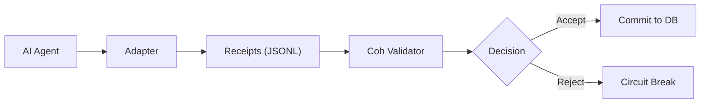

# Coh Validator

[](https://www.rust-lang.org/)
[](#)
[](#)

> **"Stops corrupted AI workflows in as little as 16ms with zero false positives."**

The **Coh Validator** is a high-performance safety kernel designed to verify autonomous AI workflows. It ensures that every step an agent takes—from data retrieval to financial reconciliation—is mathematically lawful, cryptographically intact, and semantically valid.

---

## Why This Matters

AI agents represent a new category of "silent failure" risk. When an agent hallucinates a tool output or skips a critical audit step, the system state decays invisibly. **Coh prevents this decay** by enforcing micro-step verification:

- **Detect Hallucinations**: Catch logic breaches (e.g., unauthorized value creation) the moment they occur.
- **Circuit-Break Workflows**: Immediately halt execution on any integrity violation to prevent system-wide corruption.
- **Cryptographic Audit**: Prove the exact history of a workflow with tamper-proof receipt chains.
- **Compute Waste Prevention**: Stop "zombie" workflows that have already failed their internal logic gates.

---

## The Integration Loop

Coh sits between your AI Agent and your State/DB. It acts as a deterministic "gate" that must be passed before any action is committed.



---

## Real-World Performance (Release Mode)

| Workflow Type | Audit Depth | Throughput | Detection Latency |
|:---|:---|:---|:---|
| **Integrity Audit** | 10,000 steps | **~77,500 steps/sec** | **~13ms (Early Breach)** |
| **Full Reconciliation** | 10k steps | ~66k receipts/sec | ~150ms (Full Chain) |

> **Real-World Metric**: A single CPU core can audit **~1.1 million agent steps per minute** with 100% mathematical precision.

---

## Terminology Guide
Coh uses a formal mathematical model for state transitions. Here is how to map it to your business logic:

| Term | Domain Concept | Meaning |
|:---|:---|:---|
| **v_pre** | **Unresolved Risk** | The state value/risk before the agent took action. |
| **v_post**| **Remaining Risk** | The state value/risk after the step is complete. |
| **spend** | **Operational Cost**| The amount of "capital" or "work" consumed in this step. |
| **defect**| **Uncertainty Slack**| The allowed margin of error or tolerated variance. |

---

## ⚡ The 60-Second Demo

Prove Coh’s safety kernel by running the **Hallucination Breach** demo. This demo simulates an agent that hallucinates an incorrect balance at Step 25 and shows the validator performing an immediate circuit break.

```bash
.\integrity_demo.bat
```

### Key Integration Example
See [real_agent_integration.rs](crates/coh-core/examples/real_agent_integration.rs) for a copy-pasteable template on how to wrap your LLM loops with Coh safety gating.

---

## Getting Started

### Installation
```bash
cargo build --release -p coh-validator
```

### Common Commands
- **verify-chain <path.jsonl>**: Verify an entire audit log.
- **verify-micro <path.json>**: Verify a single granular step.
- **build-slab <path.jsonl>**: Compress a verified log into a single macro-receipt.

---

## Licensing

This repository is proprietary software owned by **NoeticanLabs (Micheal Ellington)**. No commercial use, redistribution, hosting, or derivative commercial deployment is permitted without prior written permission. The project name, product identity, and related branding are reserved trademarks/service identifiers of NoeticanLabs.

**Built with rigor by the Antigravity Team.**
