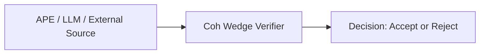

# APE Implementation Plan - Coh Wedge Integration

## 1. Integration Mapping

### 1.1 Existing Infrastructure to Leverage

| APE Component | Coh Wedge Module | Integration |
|----------------|------------------|-------------|
| Canonicalization | [`canon.rs`](coh-node/crates/coh-core/src/canon.rs) | Use `to_canonical_json_bytes()` + JCS |
| Hashing | [`hash.rs`](coh-node/crates/coh-core/src/hash.rs) | Use `sha256()`, `compute_chain_digest()` |
| Verification | [`verify_micro.rs`](coh-node/crates/coh-core/src/verify_micro.rs) | Call `verify_micro()` for micro receipts |
| Verification | [`verify_chain.rs`](coh-node/crates/coh-core/src/verify_chain.rs) | Call `verify_chain()` for chains |
| Verification | [`verify_slab.rs`](coh-node/crates/coh-core/src/verify_slab.rs) | Call `verify_slab_*()` for slabs |
| Slab Building | [`build_slab.rs`](coh-node/crates/coh-core/src/build_slab.rs) | Call `build_slab()` for building |
| Rejection Codes | [`reject.rs`](coh-node/crates/coh-core/src/reject.rs) | Map strategy failures to `RejectCode` |
| Data Types | [`types.rs`](coh-node/crates/coh-core/src/types.rs) | `MicroReceiptWire`, `SlabReceiptWire` |

### 1.2 Target Schema

APE will generate candidates that conform to these wire formats:

**MicroReceiptWire** - see [`types.rs:52-66`](coh-node/crates/coh-core/src/types.rs:52-66)
```json
{
  "schema_id": "coh.receipt.micro.v1",
  "version": "1.0.0",
  "object_id": "string",
  "canon_profile_hash": "hex64",
  "policy_hash": "hex64",
  "step_index": 0,
  "step_type": "Option<string>",
  "signatures": "Option<Vec>",
  "state_hash_prev": "hex64",
  "state_hash_next": "hex64",
  "chain_digest_prev": "hex64",
  "chain_digest_next": "hex64",
  "metrics": { "v_pre", "v_post", "spend", "defect" }
}
```

---

## 2. Project Structure

```
ape/
├── Cargo.toml                  # Depends on coh-core
├── src/
│   ├── lib.rs                  # Public exports
│   ├── engine.rs               # Strategy dispatcher
│   ├── proposal.rs             # Proposal envelope
│   ├── seed.rs                 # Deterministic RNG (PCG32)
│   ├── pipeline.rs              # Execution pipeline
│   ├── serializer.rs           # JSON helpers
│   ├── adapter.rs              # LLM adapter trait + mock impl
│   └── strategies/
│       ├── mod.rs
│       ├── mutation.rs         # Strategy: Mutation
│       ├── recombination.rs     # Strategy: Recombination
│       ├── violation.rs        # Strategy: Violation
│       ├── overflow.rs         # Strategy: Overflow
│       └── contradiction.rs    # Strategy: Contradiction
├── tests/
│   ├── mod.rs
│   ├── deterministic.rs        # Test same seed = same output
│   ├── integrations.rs         # Test with Coh Wedge
│   ├── llm_prototype.rs        # Test adapter integration
│   └── fuzz_cases.rs           # Edge case catalog
├── examples/
│   └── cli.rs                  # CLI tool
└── benches/
    └── bench.rs               # Performance benchmarks
```

---

## 3. Core Components Design

### 3.1 Proposal Envelope

```rust
// ape/src/proposal.rs

use serde::{Deserialize, Serialize};

#[derive(Clone, Debug, Serialize, Deserialize)]
pub struct Proposal {
    pub prompt: String,
    pub proposal_id: String,        // Deterministic hash
    pub strategy: Strategy,
    pub seed: u64,
    pub candidate: Candidate,
}

#[derive(Clone, Debug, Serialize, Deserialize)]
#[serde(tag = "type")]
pub enum Candidate {
    Micro(MicroReceiptWire),
    Chain(Vec<MicroReceiptWire>),
    Slab(SlabReceiptWire),
}
```

### 3.2 Strategy Enum

```rust
// ape/src/engine.rs

#[derive(Clone, Copy, Debug, PartialEq, Eq, Serialize, Deserialize)]
pub enum Strategy {
    Mutation,        // Slightly corrupt valid states
    Recombination,  // Merge multiple states incorrectly
    Violation,      // Break invariants
    Overflow,      // Stress numeric limits
    Contradiction, // Break logical coherence
}
```

### 3.3 Seeded RNG

```rust
// ape/src/seed.rs

pub struct SeededRng(u32, u32);  // PCG32 state

impl SeededRng {
    pub fn new(seed: u64) -> Self {
        // Split seed into state
        let state = (seed as u32, (seed >> 32) as u32);
        Self(state.0, state.1)
    }
    
    pub fn next(&mut self) -> u32 {
        // PCG32 output
        // ...
    }
}
```

---

## 4. LLM/AI Adapter (Prototype Integration)

### 4.1 Adapter Trait

Following the pattern from [`generic_agent_loop.rs`](coh-node/examples/integrations/generic_agent_loop.rs), APE includes an adapter trait for LLM integration:

```rust
// ape/src/adapter.rs

use coh_core::types::{MicroReceiptWire, MetricsWire};

/// LLM Response - the output from an AI agent
#[derive(Debug, Clone)]
pub struct LlmResponse {
    pub step_index: u64,
    pub v_pre: u128,       // Value before this step
    pub v_post: u128,      // Value agent claims after
    pub spend: u128,        // Resources consumed
    pub defect: u128,      // Approved variance
    pub state_hash_prev: String,
    pub state_hash_next: String,
}

/// Adapter trait for LLM providers
/// Replace with actual API calls in production
pub trait LlmAdapter: Send + Sync {
    /// Call the LLM and get a response
    fn generate(&self, prompt: &str) -> Result<LlmResponse, AdapterError>;
}

/// Mock adapter - deterministic LLM simulation
pub struct MockLlmAdapter {
    seed: u64,
}

impl MockLlmAdapter {
    pub fn new(seed: u64) -> Self {
        Self { seed }
    }
}

impl LlmAdapter for MockLlmAdapter {
    fn generate(&self, prompt: &str) -> Result<LlmResponse, AdapterError> {
        // Deterministic "LLM" that mimics agent behavior
        // Uses seeded RNG to produce consistent outputs
        // Can be configured to generate valid OR invalid responses
    }
}
```

### 4.2 LLM-to-Receipt Conversion

```rust
// ape/src/adapter.rs

impl LlmResponse {
    pub fn to_micro_receipt(&self, object_id: &str, canon_profile_hash: &str) -> MicroReceiptWire {
        MicroReceiptWire {
            schema_id: "coh.receipt.micro.v1".to_string(),
            version: "1.0.0".to_string(),
            object_id: object_id.to_string(),
            canon_profile_hash: canon_profile_hash.to_string(),
            policy_hash: "0".repeat(64),
            step_index: self.step_index,
            step_type: Some("llm_step".to_string()),
            signatures: None,
            state_hash_prev: self.state_hash_prev.clone(),
            state_hash_next: self.state_hash_next.clone(),
            chain_digest_prev: "0".repeat(64), // Filled by sealer
            chain_digest_next: "0".repeat(64), // Filled by sealer
            metrics: MetricsWire {
                v_pre: self.v_pre.to_string(),
                v_post: self.v_post.to_string(),
                spend: self.spend.to_string(),
                defect: self.defect.to_string(),
            },
        }
    }
}
```

### 4.3 Prototype Mode

APE operates as an **LLM prototype** in two modes:

1. **Simulation Mode** (Default)
   - Uses `MockLlmAdapter` to generate candidates
   - Deterministic based on seed
   - Mimics AI agent behavior (hallucinations, policy violations)
   - For testing/development without API costs

2. **Live Mode** (Future)
   - Implement `LlmAdapter` for OpenAI/Anthropic
   - Real LLM calls via API
   - Same verification pipeline

---

## 5. Strategy Implementations

### 5.1 Mutation Strategy

| Target Field | Mutation Type |
|--------------|----------------|
| `step_index` | ±1 offset |
| `metrics.*` | ±10% variation |
| `object_id` | Character swap |
| `state_hash_next` | Flip one byte |
| `signatures` | Remove one signature |

**Integration**: Uses valid `MicroReceiptWire` as base, applies controlled corruption.

### 5.2 Recombination Strategy

| Target | Operation |
|--------|-----------|
| Chain | Swap `state_hash_next` i with `state_hash_prev` i+1 |
| Chain | Copy fields from receipt i to receipt i+1 |
| Slab | Use mismatched `range_start`/`range_end` |

**Integration**: Breaks chain continuity invariants that Coh Wedge verifies.

### 5.3 Violation Strategy

| Invariant | Violation |
|-----------|------------|
| Schema ID | Use wrong string |
| Version | Use unsupported version |
| Chain Digest | Mismatched chain digest |
| State Hash Link | `state_hash_prev` != previous `state_hash_next` |

**Integration**: Uses [`verify_chain`](coh-node/crates/coh-core/src/verify_chain.rs) to detect.

### 5.4 Overflow Strategy

| Target | Attack |
|--------|--------|
| `metrics.v_pre` | Set to MAX u128 |
| `metrics.spend` | Set to MAX u128 |
| `summary.total_spend` | Set to overflow value |
| `step_index` | Set to u64::MAX |

**Integration**: Uses [`CheckedMath`](coh-node/crates/coh-core/src/math.rs) in verification.

### 5.5 Contradiction Strategy

| Assertion | Contradiction |
|-----------|--------------|
| v_post = v_pre - spend | v_post > v_pre |
| Total defect tracking | Defect doesn't match delta |
| Range consistency | `range_end - range_start + 1 != micro_count` |

**Integration**: Breaks accounting invariants tested by slab verification.

---

## 7. Pipeline Execution

```rust
// ape/src/pipeline.rs

pub enum PipelineResult {
    Generated(Proposal),
    Verified {
        proposal: Proposal,
        decision: Decision,
        code: Option<RejectCode>,
        message: String,
    },
}

pub fn run(input: &Input, strategy: Strategy, seed: u64) -> PipelineResult {
    // 1. Generate candidate
    let proposal = engine::generate(strategy, input, seed);
    
    // 2. Verify against Coh Wedge
    let result = match &proposal.candidate {
        Candidate::Micro(wire) => {
            verify_micro(wire.clone())
        }
        Candidate::Chain(wires) => {
            verify_chain(wires.clone())
        }
        Candidate::Slab(wire) => {
            verify_slab_envelope(wire.clone())
        }
    };
    
    PipelineResult::Verified { proposal, decision, code, message }
}
```

---

## 7. Integration Points Summary



### Flow Summary

- **APE** acts as the **input source** to Coh Wedge
- Input can come from: 
  - Internal strategy engine (Mutation, Recombination, etc.)
  - LLM adapter (Mock or real API)
  - External system (any JSON input)
- **Coh Wedge** performs verification and returns decision

| APE Module | Calls Coh Wedge | Returns |
|-----------|----------------|----------|
| `pipeline` | `coh_core::verify_micro` | `VerifyMicroResult` |
| `pipeline` | `coh_core::verify_chain` | `VerifyChainResult` |
| `pipeline` | `coh_core::verify_slab_envelope` | `VerifySlabResult` |
| `pipeline` | `coh_core::build_slab` | `BuildSlabResult` |

---

## 8. Testing Plan

### 8.1 Unit Tests

- [ ] Determinism: Same (strategy, input, seed) → identical proposal
- [ ] Strategy coverage: Each strategy produces valid JSON
- [ ] Seed boundaries: 0, 1, u64::MAX
- [ ] Adapter: Mock produces consistent LLM-like outputs

### 8.2 Integration Tests

- [ ] Valid → Accept: Mutation near-valid → verify_micro accepts
- [ ] Invalid digest → verify_chain rejects with RejectChainDigest
- [ ] Invalid state link → verify_chain rejects with RejectStateHashLink
- [ ] Overflow → verify_micro rejects with RejectOverflow
- [ ] Schema violation → verify_micro rejects with RejectSchema

### 8.3 Chaos Tests

- [ ] 1000 random seeds → no panics
- [ ] All strategies → valid JSON output
- [ ] Fuzz: invalid UTF-8, truncated JSON

### 8.4 LLM Prototype Tests

- [ ] Mock adapter generates valid receipts that pass verification
- [ ] Mock adapter generates hallucinated receipts that fail verification
- [ ] Mock adapter generates policy-violating receipts that fail verification
- [ ] Same seed + same strategy → same verification outcome (determinism)

---

## 9. CLI Interface

```bash
# Generate a violating micro receipt
ape generate --strategy violation --seed 42 --input examples/micro_valid.json

# Generate an overflow slab
ape generate --strategy overflow --seed 123 --type slab --input examples/slab_valid.json

# Full pipeline: generate + verify
ape test --strategy recombination --seed 999 --verbose

# Batch test
ape bench --iterations 10000 --output results.json

# LLM prototype mode
ape llm-run --prompt "simulate agent step" --strategy mutation --seed 42
```

---

## 10. Implementation Checklist

- [ ] Create `ape/` subdirectory in workspace
- [ ] Create `ape/Cargo.toml` with coh-core dependency
- [ ] Implement `seed.rs` - deterministic RNG
- [ ] Implement `proposal.rs` - data structures
- [ ] Implement `engine.rs` - strategy dispatcher
- [ ] Implement `adapter.rs` - LLM adapter trait + mock impl
- [ ] Implement `strategies/mutation.rs`
- [ ] Implement `strategies/recombination.rs`
- [ ] Implement `strategies/violation.rs`
- [ ] Implement `strategies/overflow.rs`
- [ ] Implement `strategies/contradiction.rs`
- [ ] Implement `pipeline.rs` - full execution
- [ ] Add integration tests
- [ ] Add LLM prototype tests
- [ ] Add CLI example

---

## 11. Next Steps

**When approved**: Move to Code mode to implement APE crate.

**Priority**: 
1. Core data structures + deterministic seed
2. LLM adapter trait + mock implementation  
3. Strategy implementations
4. Pipeline integration with Coh Wedge verification