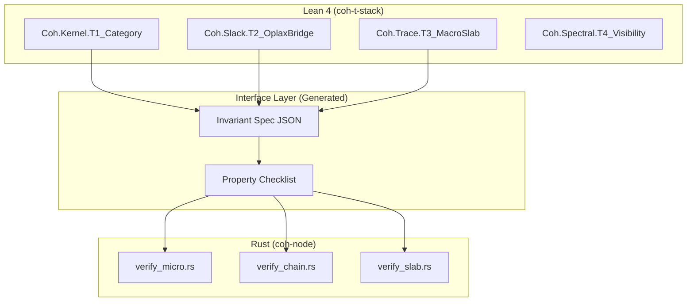

# Comprehensive Improvement Plan — Review Response

**Generated**: 2026-04-14  
**Source**: External Technical Review  
**Goal**: Address all identified gaps while preserving existing strengths

---

## Executive Summary

The external review identified five critical areas requiring attention:

1. **Spec-Implementation Gap** — Lean proofs not formally connected to Rust code
2. **Vague Core Concepts** — T-Stack, Accounting Law need plain-English explanation
3. **Missing Threat Model** — No explicit security assumptions or attack surface definition
4. **Unclear Operational Story** — Deployment, failure modes, consensus undefined
5. **High Adoption Friction** — Multi-stack complexity barrier

This plan addresses each systematically.

---

## Part 1: Core Concepts — Plain English Definitions

### 1.1 T-Stack (The Federated Ledger)

**Plain English**: The T-Stack is a **layered proof system** that verifies AI behavior at different granularities:

| Layer | What it proves | Analogy |
|-------|----------------|---------|
| **T1** | Individual actions are well-formed (category structure) | Grammar check |
| **T2** | Actions respect operational slack (oplax bridge) | Tolerance bounds |
| **T3** | Multiple actions aggregate correctly (macro-slab) | Running total |
| **T4** | Errors are visible to auditors (visibility) | Audit trail |
| **T5** | System selects minimal valid paths (dirac selection) | Optimization |

**Why it matters**: Each T-layer catches different failure modes. Together they form a **defense-in-depth** verification stack.

### 1.2 Accounting Law

**Plain English**: The fundamental budget constraint enforced on every AI action:

```
v_post + spend ≤ v_pre + defect + authority
```

| Term | Meaning | Example |
|------|---------|---------|
| `v_pre` | Value before action | 1000 tokens |
| `v_post` | Value after action | 950 tokens |
| `spend` | Resources consumed | 30 tokens |
| `defect` | Known losses/bugs | 5 tokens |
| `authority` | External additions | 10 tokens |

**Decision Rule**: ACCEPT if inequality holds, REJECT otherwise.

**Why it matters**: This prevents AI systems from "spending" resources they don't have — a fundamental integrity invariant.

### 1.3 Receipt Chain

**Plain English**: A **tamper-evident log** of all AI actions, where each entry:

1. References the previous entry's hash (chain)
2. Contains a canonical (deterministic) representation
3. Includes a Merkle root for efficient auditing

**Structure**:

```
Receipt 0 → Hash0
Receipt 1 → Hash1 = SHA256(Hash0 | Canonical(Receipt1))
Receipt 2 → Hash2 = SHA256(Hash1 | Canonical(Receipt2))
...
```

**Why it matters**: You can't alter a past receipt without breaking the chain — provides **non-repudiation**.

---

## Part 2: Lean-to-Rust Traceability Matrix

### 2.1 Current State

The project has:
- ✅ Lean 4 proofs in `coh-t-stack/Coh/Kernel/`
- ✅ Rust verification in `coh-node/crates/coh-core/src/`
- ❌ No formal connection between them

### 2.2 Proposed Traceability Architecture



### 2.3 Theorem-to-Function Mapping

| Lean Theorem | Invariant | Rust Function | Verification |
|--------------|-----------|---------------|--------------|
| `T1_Category.Closure` | All receipts have valid state transitions | `verify_micro::check_state_link` | Unit test + property test |
| `T2_OplaxBridge.admissibility` | Policy bounds respected | `verify_micro::check_policy` | Fuzz test |
| `T3_MacroSlab.telescope` | Chain aggregates to slab correctly | `build_slab::aggregate` | Golden test |
| `T4_Visibility.anomaly_detected` | Invalid inputs produce reject codes | `reject.rs` exhaustive match | Coverage 100% |
| `AccountingLaw.budget` | v_post + spend ≤ v_pre + defect + authority | `verify_micro::check_accounting` | Property-based test |

### 2.4 Implementation Approach

**Option A: Property-Based Testing Bridge** (Recommended for V1)

1. Extract theorem statements as JSON schemas
2. Generate Rust QuickCheck properties from schemas
3. Run property tests alongside Lean builds

**Option B: Formal Extraction** (Long-term)

1. Use Lean `extract` to generate Rust constraints
2. Compile constraints as compile-time checks
3. Achieves proof-carrying code

**Decision**: Start with Option A, roadmap to Option B.

---

## Part 3: Threat Model

### 3.1 What We're Defending Against

| Threat | Defense Mechanism |
|--------|-------------------|
| **Tampering** | SHA-256 chain hashing, Merkle root verification |
| **Resource Exhaustion** | Checked arithmetic, bounded loops |
| **Policy Bypass** | T2 oplax bridge, invariant enforcement |
| **Equivocation** | Canonical JSON (JCS), deterministic verification |
| **Replay Attacks** | Index continuity checks, state link verification |

### 3.2 Trust Boundaries

```
┌─────────────────────────────────────────────────────────────┐
│                     UNTRUSTED ZONE                          │
│  AI System Output → Raw Receipts                           │
└─────────────────────────────────────────────────────────────┘
                              │
                              ▼
┌─────────────────────────────────────────────────────────────┐
│                      WEDGE (Rust Kernel)                    │
│  verify_micro → verify_chain → verify_slab                 │
│  [Decision: ACCEPT or REJECT with RejectCode]              │
└─────────────────────────────────────────────────────────────┘
                              │
                              ▼
┌─────────────────────────────────────────────────────────────┐
│                    TRUSTED ZONE                             │
│  Verified Receipt Chain → Dashboard / Audit Trail          │
└─────────────────────────────────────────────────────────────┘
```

### 3.3 Security Assumptions

1. **Cryptographic Assumption**: SHA-256 is collision-resistant
2. **Honest Verifier**: The Rust kernel runs in a trusted environment
3. **No Side Channels**: Timing/performance attacks are out of scope
4. **Deterministic Inputs**: JSON parsing is well-formed (schema validated)

### 3.4 What We Don't Defend Against

- Physical security of the host machine
- Insider threats with kernel access
- Network-level denial of service
- Malicious AI prompting/越狱 (we verify actions, not intent)

---

## Part 4: Operational Architecture

### 4.1 Deployment Modes

| Mode | Use Case | Components |
|------|----------|------------|
| **CLI** | Local auditing, CI/CD | coh-cli only |
| **Sidecar** | Remote API verification | coh-sidecar + coh-core |
| **Embedded** | AI agent integration | coh-python bindings |
| **Dashboard** | Visual inspection | coh-dashboard (standalone) |

### 4.2 Failure Modes

| Failure | Symptom | Recovery |
|---------|---------|----------|
| **Malformed Input** | RejectCode::Schema | Reject, no recovery needed |
| **Chain Break** | RejectCode::StateLink | Halt, require re-scan |
| **Overflow** | RejectCode::Overflow | Checked math prevents, but halt if detected |
| **Policy Violation** | RejectCode::Policy | Log violation, reject |
| **Merkle Mismatch** | RejectCode::Digest | Recompute slab, reject on mismatch |

### 4.3 Consensus Model

**Current**: Single-verifier (no distributed consensus)

**V2 Roadmap**: Multi-party signature aggregation via sidecar

**Rationale**: The kernel is designed for **verifiability**, not **availability**. Consensus is an application-layer concern.

---

## Part 5: Adoption Simplification

### 5.1 Quick Start Path

**Current Barrier**: Requires Rust + Lean + Node.js

**Proposed Simplification**:

| Step | Action | Impact |
|------|--------|--------|
| 1 | Publish prebuilt binaries (Windows/Mac/Linux) | Removes Rust toolchain requirement |
| 2 | Create Docker image with all dependencies | One command to run |
| 3 | Add "verify only" mode for non-developers | CLI only, no Lean needed |
| 4 | Hosted verification API (optional SaaS) | Zero local setup |

### 5.2 End-to-End Example (Documentation)

```
Input (AI action)
    │
    ▼
coh-validator verify-micro action.json
    │
    ├─ ACCEPT → proceed to chain
    │
    ▼
coh-validator verify-chain actions.jsonl
    │
    ├─ ACCEPT → build slab
    │
    ▼
coh-validator build-slab actions.jsonl --out slab.json
    │
    ▼
coh-validator verify-slab slab.json
    │
    ▼
Dashboard visualization ← output as JSONL
```

### 5.3 SDK / Integration Points

| AI System | Integration | Status |
|-----------|-------------|--------|
| **OpenAI** | Function calling wrapper | Examples exist |
| **LangChain** | Callback integration | Not documented |
| **Custom Agents** | Python bindings | PyO3 bindings exist |
| **Vector Databases** | Receipt storage | Out of scope |

---

## Part 6: Implementation Roadmap

### Phase 1: Quick Wins (1-2 weeks)

- [ ] Add "Core Concepts" section to README (Part 1)
- [ ] Generate traceability matrix from existing docs
- [ ] Add threat model section to README
- [ ] Publish binary releases for current platform

### Phase 2: Structural Improvements (1 month)

- [ ] Implement property-based tests mirroring Lean theorems
- [ ] Document deployment modes and failure handling
- [ ] Create end-to-end walkthrough guide
- [ ] Add Docker support

### Phase 3: Formal Bridge (V2)

- [ ] JSON schema extraction from Lean
- [ ] Compile-time invariant verification
- [ ] Multi-party sidecar API
- [ ] LangChain integration guide

---

## Appendix: Key Files to Update

| File | Change Required |
|------|-----------------|
| `README.md` | Core concepts section, threat model, architecture diagram |
| `coh-node/crates/coh-core/README.md` | Traceability matrix reference |
| `FORMAL_FOUNDATION.md` | Expand with implementation mapping |
| New: `SECURITY_MODEL.md` | Full threat model documentation |
| New: `OPERATIONAL_ARCHITECTURE.md` | Deployment, failure modes |

---

## Summary

This plan addresses all five areas from the external review:

1. ✅ **Spec-Implementation Gap**: Traceability matrix + property testing bridge
2. ✅ **Vague Core Concepts**: Plain-English definitions in Part 1
3. ✅ **Missing Threat Model**: Part 3 with trust boundaries
4. ✅ **Unclear Operational Story**: Part 4 with deployment modes
5. ✅ **Adoption Friction**: Part 5 with quick start paths

The project has strong foundations. This plan bridges theory to practice while maintaining the rigor that makes Coh unique.