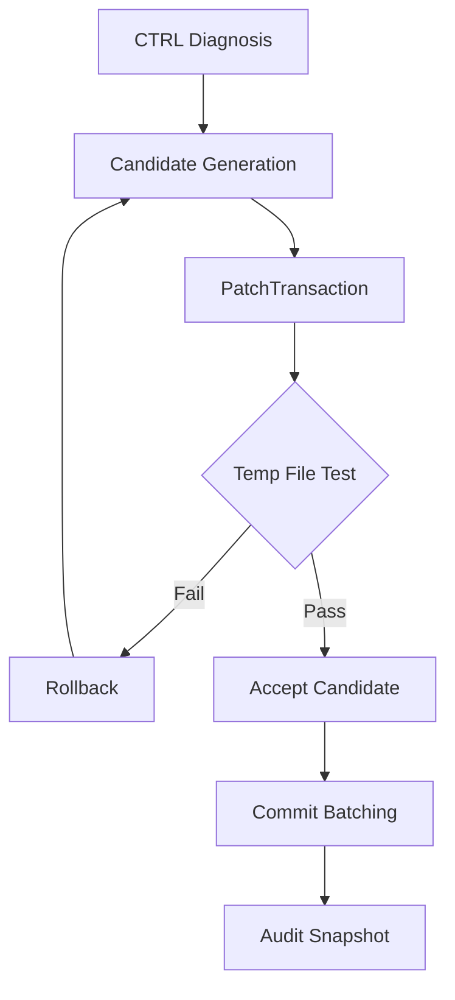

# CTRL Set 3: Safety & Real Target Activation

## Current Status

| Layer | Status |
| --- | --- |
| LeanWorker execution | ✅ Operational |
| Failure memory / dedup | ✅ Operational |
| Structured candidates | ✅ Operational |
| Candidate ranking | ✅ Operational |
| Per-attempt audit trail | ✅ Operational |
| Benchmark suite | ✅ Present |
| Patch transaction safety | ❌ Next |
| Lean error parser | ❌ Next |
| Real Coh theorem integration | ⚠️ Next |

## What's Needed: 6/10 → 7/10

To move from "operational prototype" to "real-theorem-ready" status, two things are needed:

1. **Patch safety**: Test repairs in temp files, only commit accepted patches
2. **Lean error parsing**: Classify actual goal/error structure instead of relying on heuristics

## Plan: 5 Items

### 1. PatchTransaction: Temp-file Repair System

**Goal**: All Lean patches tested in isolation before affecting real files.

Components:

- `PatchTransaction` struct wrapping proposed change
- Temp-file lifecycle management
- Verify-before-commit workflow
- Rollback on failure

Implementation approach:
- Create `_repair_temp.lean` in coh-t-stack for isolated testing
- Each candidate attempt writes to temp file, NOT original
- Lean verification on temp file succeeds → candidate passes
- Accepted candidates → batched commit to real file

### 2. Rollback-safe Commit Path

**Goal**: No corrupt state if multiple patches processed.

Components:
- Transaction log for patch sequence
- Commit batching: accumulate accepted → single atomic write
- Rollback marker if commit fails mid-sequence

### 3. Structured LeanErrorKind Parser

**Goal**: Replace heuristic classification with actual error parsing.

Lean error categories to parse:
- `too many arguments`
- `unknown identifier`
- `type mismatch`
- `invalid binder`
- `goal incomplete`
- `tactic failed`

Implementation:
- Parser extracts specific Lean error codes
- Maps to `LeanErrorKind` enum
- Uses error classification for better ranking

### 4. Benchmark Audit JSON Snapshots

**Goal**: Track CTRL evolution over time.

Schema:
```json
{
  "timestamp": "ISO8601",
  "session_id": "uuid",
  "attempts": [...],
  "candidates": [...],
  "accepted": [...],
  "metrics": {...}
}
```

### 5. First Real Coh Theorem Target

**Goal**: Apply CTRL to actual theorem: `v_post + spend ≤ v_pre + defect + authority`

Target theorem from `coh-t-stack/Coh/Boundary/LawOfCoherence.lean`:

```
theorem accounting_axiom 
  (v_pre v_post : ℕ) 
  (spend defect authority : ℕ)
  (h : v_post + spend ≤ v_pre + defect + authority) :
  True := by trivial
```

This theorem directly mirrors the Rust kernel constraint.

## Todo List

- [ ] 1. Implement PatchTransaction with temp-file repair workflow
- [ ] 2. Add rollback-safe commit path with transaction logging
- [ ] 3. Build structured LeanErrorKind parser for error classification
- [ ] 4. Create benchmark audit JSON snapshot tooling
- [ ] 5. Integrate accounting theorem as first real target

## Architecture



## Risk Notes

- Temp file I/O needs cleanup strategy
- Commit batching must maintain order
- Lean error parsing depends on Lean version stability