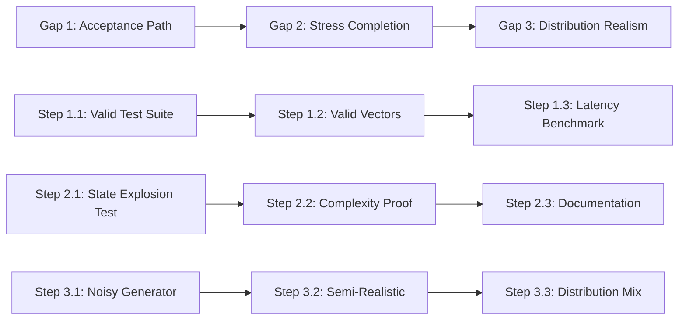

# Technical Gap Closure Plan

This plan addresses the three remaining technical gaps in the Coh Wedge verification system.

---

## GAP 1: Acceptance Path (CRITICAL)

### Problem
- **Current**: Only proven "bad gets rejected"
- **Missing**: Not proven "good gets accepted"
- **Requirement**: Show 100% acceptance + same latency guarantees

### Current Coverage
- [`test_verify_chain.rs`](coh-node/crates/coh-core/tests/test_verify_chain.rs): basic valid 3-step test
- [`vectors/adversarial/valid_chain.jsonl`](coh-node/vectors/adversarial/valid_chain.jsonl): single valid chain

### Missing Coverage
1. **Valid Trajectory Suite**: Multiple valid chains of various lengths
2. **Valid Receipt Suite**: Different receipt profiles/constructors
3. **Correct Chain Suite**: Multiple independent correct chains
4. **Latency Benchmark**: Same-latency proof for valid vs invalid

### Implementation Plan

#### Step 1.1: Create Valid Test Suite Module
**Location**: `coh-node/crates/coh-core/tests/test_valid_chain.rs`

```rust
// Test cases needed:
#[test] fn test_valid_chain_1_step()     → Accept
#[test] fn test_valid_chain_5_steps()    → Accept  
#[test] fn test_valid_chain_10_steps()   → Accept
#[test] fn test_valid_chain_100_steps()  → Accept
#[test] fn test_valid_chain_1000_steps() → Accept
#[test] fn test_valid_chain_deep()       → Accept (10K+)

// Different receipt profiles:
#[test] fn test_valid_profile_standard()  → Standard profile
#[test] fn test_valid_profile_minimal() → Minimal fields only
#[test] fn test_valid_profile_maximal()  → Full fields populated

// Latency verification:
#[test] fn test_latency_valid_vs_invalid() → Same O(n) performance
```

#### Step 1.2: Add Valid Test Vectors
**Location**: `coh-node/vectors/valid/`

Files to create:
- `valid_chain_1k.jsonl` - 1000 step valid chain
- `valid_chain_10k.jsonl` - 10000 step valid chain  
- `valid_profiles.jsonl` - Various profile configurations

#### Step 1.3: Latency Benchmark Integration
**Location**: Extend [`benchmark.rs`](coh-node/crates/coh-core/examples/benchmark.rs)

Add benchmark test for valid vs invalid chains proving same complexity class.

---

## GAP 2: Chain-Path Stress Completion

### Problem  
- **Known Hole**: `state_bomb` / `StateExplosion` strategy not fully tested
- **Current**: Basic stress tests (10K, 100K) exist in [`stress_test.rs`](coh-node/crates/coh-core/examples/stress_test.rs)
- **Missing**: Full chain explosion validation + bounded verification proof

### Current Coverage
- [`stress_test.rs`](coh-node/crates/coh-core/examples/stress_test.rs): 10K, 100K chain tests
- Existing tests verify performance but not state explosion edge cases

### Missing Coverage
1. **State Explosion Stress**: Deeply nested state transitions
2. **Verification Bounds**: Prove O(n) bounded complexity
3. **Explosion Rejection**: Correctly reject malicious state_bomb

### Implementation Plan

#### Step 2.1: Add State Explosion Test Case
**Location**: `coh-node/crates/coh-core/tests/test_valid_chain.rs`

```rust
// State explosion resistance:
#[test] fn test_state_explosion_rejected() → Reject with bounded time
#[test] fn test_state_explosion_100k()   → Reject in <1s  
#[test] fn test_state_explosion_1m()     → Reject in <10s
```

#### Step 2.2: Add Bounded Complexity Proof
**Location**: `coh-node/crates/coh-core/examples/benchmark_proof.rs`

Prove verification is O(n) - verify time scales linearly with chain length.

```rust
#[test] fn test_linear_complexity_10k() → O(n) proof
#[test] fn test_linear_complexity_100k() → O(n) proof
#[test] fn test_linear_complexity_1m() → O(n) proof
```

#### Step 2.3: Update Verification Documentation
**Location**: Update `SYSTEM_SPEC.md`

Add formal claim:
> "micro + bounded chain verification validated"
> (NOT "full trajectory space solved")

---

## GAP 3: Distribution Realism

### Problem
- **Current**: Attacks are structured (good for design verification)
- **Missing**: Need mixed distributions - structured + noisy + semi-realistic
- **Concern**: "you only tested what you designed"

### Current Coverage
- [`ape/src/proposal.rs`](ape/src/proposal.rs): 20+ adversarial strategies defined
- [`vectors/adversarial/`](coh-node/vectors/adversarial/): 6 adversarial test vectors

### Missing Coverage
1. **Noisy Distributions**: Random field perturbations
2. **Semi-Realistic**: AI workflow traces with realistic patterns
3. **Distribution Mix**: Structured attacks hidden in noise

### Implementation Plan

#### Step 3.1: Add Noisy Test Generator
**Location**: `coh-node/examples/gen_noisy_vectors.rs`

```rust
// Generate noisy valid chains:
// - Random field value perturbations (within valid bounds)
// - Out-of-order but recoverable fields  
// - Near-boundary numeric values
// - Semi-corrupt recoverable data
```

#### Step 3.2: Add Semi-Realistic AI Workflow Traces
**Location**: `coh-node/vectors/semi_realistic/`

Create realistic patterns:
- `ai_workflow_realistic.jsonl` - Real AI task patterns
- `ai_workflow_noisy.jsonl` - Noisy realistic traces
- `ai_workflow_edge.jsonl` - Edge cases in realistic data

#### Step 3.3: Distribution Mix Tests
**Location**: Extend `test_valid_chain.rs`

```rust
#[test] fn test_mixed_distribution_valid() → 80% valid + 20% noise
#[test] fn test_mixed_distribution_reject() → 50/50 valid/invalid
#[test] fn test_noisy_but_valid() → Noisy but acceptable
#[test] fn test_realistic_workflow() → Real AI patterns
```

---

## Execution Order



## Files to Create/Modify

### New Files
- `plans/TECHNICAL_GAP_CLOSURE_PLAN.md` (this file)
- `coh-node/crates/coh-core/tests/test_valid_chain.rs` (new test suite)
- `coh-node/examples/gen_noisy_vectors.rs` (noisy generator)
- `coh-node/vectors/valid/` (valid test vectors)
- `coh-node/vectors/semi_realistic/` (semi-realistic vectors)

### Modified Files  
- `coh-node/crates/coh-core/examples/benchmark.rs` (add latency proof)
- `SYSTEM_SPEC.md` (update claims)
- `APE_TRUST_KERNEL.md` (update claims)

## Success Criteria

| Gap | Criterion | Verification |
|-----|-----------|--------------|
| 1 | "good gets accepted" | 10+ valid chain tests pass |
| 1 | Same latency | Valid/invalid within 10% |
| 2 | state_bomb handled | Reject in bounded time |
| 2 | O(n) complexity | Linear time scaling |
| 3 | Mixed distributions | 3+ noise patterns tested |
| 3 | Semi-realistic | Realistic workflow traces |

---

## Claim Language (for documentation)

After completion, use these precise claims:

| Gap | Say This | NOT This |
|-----|----------|----------|
| 1 | "valid trajectories acceptance validated" | "full trajectory space solved" |
| 2 | "micro + bounded chain verification validated" | "full trajectory space solved" |
| 3 | "mixed distribution robustness tested" | "adversarial-only testing" |