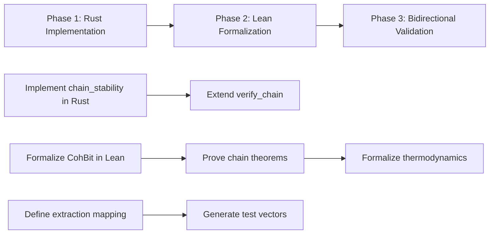

# Lean 4 Formalization Plan: Rust-to-Lean Bridge

**Objective:** Formalize the Cohbit framework in Lean 4 to prove all laws true, and ensure Rust implementation matches Lean specification bidirectionally.

## 1. Gap Analysis Summary

### 1.1 Lean → Rust Gaps (Formalism Defined but Missing in Rust)
| Lean File | Theorem/Definition | Status | Required Rust Implementation |
|---|---|---|---|
| `Coh/Boundary/CohBit.lean:98` | `chain_stability` (telescoping sum) | **Missing (sorry)** | Implement telescoping sum check in [`cohbit.rs`](coh-node/crates/coh-core/src/cohbit.rs) |
| `Coh/Boundary/CohBit.lean:75` | `identity_exists` | **Partial** | Ensure `id_action` semantics in Rust |
| `Coh/Boundary/LawOfGenesis.lean:24` | `genesis_composition` | **Proved** | Validate generation engine respects additive cost/slack |
| `Coh/Boundary/LawOfCoherence.lean:32` | `coherence_composition` | **Proved** | Validate slab builder respects additive defect/authority |

### 1.2 Rust → Lean Missing (Implementation Exists but No Formal Proof)
| Rust File | Logic | Status | Required Lean Formalization |
|---|---|---|---|
| `CohBitLaw.verify_chain` (line 328) | Chain verification with hash continuity | **Implemented** | Formalize `CohBit` chain property in Lean |
| `CohBitLaw.compute_soft_probabilities` (line 288) | Gibbs-Boltzmann weight computation | **Implemented** | Formalize probability normalization theorem |
| `CohBitThermodynamics` (line 346) | Entropy/loss calculations | **Implemented** | Formalize entropy bounds / enforcement loss |
| `CohBit.executable` (line 249) | Combined structural + budget execution | **Implemented** | Prove `executable` implies `admissible` lemma |

---

## 2. Remediation Plan

### Phase 1: Fill Lean → Rust Gaps
- [ ] **Implement `chain_stability` in Rust**
  - Location: `coh-node/crates/coh-core/src/cohbit.rs`
  - Logic: Add function `chain_stability(bits: &[CohBit]) -> bool` that verifies telescoping inequality
  - Theorem: Prove `V_final + Σspend ≤ V_initial + Σdefect + Σauthority`
  
- [ ] **Extend `CohBitLaw.verify_chain`**
  - Location: `coh-node/crates/coh-core/src/cohbit.rs:328`
  - Add telescoping sum verification to existing state/hash chain checks

### Phase 2: Fill Rust → Lean Gaps
- [ ] **Formalize `CohBit` definition in Lean**
  - Location: `coh-t-stack/Coh/Boundary/CohBit.lean`
  - Add complete inductive definition matching `cohbit.rs:91` struct fields
  
- [ ] **Prove chain verification theorems**
  - Add `chain_state_integrity` theorem
  - Add `chain_digest_agreement` theorem
  
- [ ] **Formalize probability thermodynamics**
  - Add `soft_entropy_nonneg` theorem
  - Add `exec_entropy_le_soft_entropy` theorem (non-negativity of enforcement loss)

### Phase 3: Bidirectional Validation
- [ ] **Define extraction mapping**
  - Create `coh-t-stack/Coh/Extraction.lean` for mapping Lean proofs to Rust verification functions
  - Map Lean `GenesisAdmissible` → Rust `CohBit::executable`
  - Map Lean `CohAdmissible` → Rust `CohBit::budget_admissible`

- [ ] **Create test vectors from Lean proofs**
  - Generate Rust test fixtures from Lean theorem counterexamples

---

## 3. Key Theorems to Prove

### 3.1 Core Laws (Must Hold)
```lean
theorem genesis_composition
  {G P R : Type} [OrderedAddCommMonoid R] 
  (obj : GenesisObject G P R) (g1 g2 g3 : G) (p1 p2 : P)
  (h1 : GenesisAdmissible obj g1 p1 g2)
  (h2 : GenesisAdmissible obj g2 p2 g3) :
  obj.M g3 + (obj.C p1 + obj.C p2) ≤ obj.M g1 + (obj.D p1 + obj.D p2)
```

```lean
theorem coherence_composition
  {X Q S : Type} [OrderedAddCommMonoid S]
  (obj : CoherenceObject X Q S) (x1 x2 x3 : X) (R1 R2 : Q)
  (h1 : CohAdmissible obj x1 R1 x2)
  (h2 : CohAdmissible obj x2 R2 x3) :
  obj.V x3 + (obj.Spend R1 + obj.Spend R2) ≤ obj.V x1 + (obj.Defect R1 + obj.Defect R2) + (obj.Authority R1 + obj.Authority R2)
```

### 3.2 Chain Stability Theorem (Gap)
```lean
theorem chain_stability 
  {X Action Cert Hash : Type} {S : CohSystem X Action Cert Hash}
  (chain : List (CohBit S))
  (h_cont : ∀ i, (chain.get? i).map (·.to_state) = (chain.get? (i+1)).map (·.from_state)) :
  S.V (last chain).to_state + (chain.map S.spend).sum ≤
  (first chain).from_state + (chain.map S.defect).sum + (chain.map S.authority).sum
```

---

## 4. Execution Order



---

## 5. Success Criteria

1. **`chain_stability` theorem proved in Lean** (removing sorry from `CohBit.lean:102`)
2. **Rust `CohBitLaw.verify_chain` includes telescoping sum check**
3. **Lean theorems for probability and entropy formalized**
4. **Bidirectional mapping defined for extraction**
5. **All laws hold at both Rust and Lean levels**

---

**Plan created:** 2026-05-01
**Status:** Pending user approval