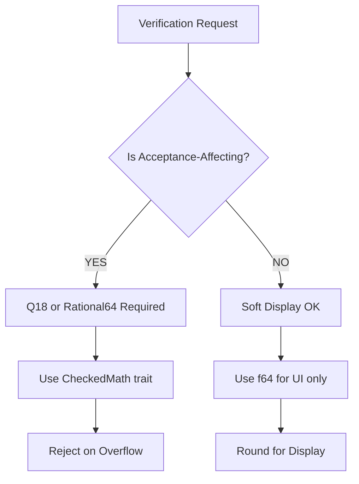

# Verifier Architecture Remediation Plan: Constraint Alignment

**Generated**: 2026-05-03  
**Purpose**: Close architectural gaps between theoretical specifications and Rust/Python implementation

---

## Executive Summary

This plan addresses 6 critical constraints that must be enforced to align the `coh-verifier-prototype` with the mathematical and structural specifications formalized in the Lean4 theoretical notebooks.

| Constraint | Status | Priority |
|------------|--------|----------|
| 1. Implementation Hierarchy (Rust/Python) | ⚠️ PARTIAL | HIGH |
| 2. Arithmetic Determinism (Q18) | ⚠️ PARTIAL | CRITICAL |
| 3. Spend/Defect Separation | ✅ DONE | LOW |
| 4. Oplax Composition | ⚠️ STUBBED | HIGH |
| 5. TOCTOU Protection | ⚠️ PARTIAL | CRITICAL |
| 6. Public Visualization | ⚠️ REVIEW | MEDIUM |

---

## Constraint 1: Implementation Hierarchy (Rust/Python Boundary)

**Requirement**: The Rust deterministic kernel must be fully defined and compiled FIRST. Python is a secondary interface that wraps the hardened Rust core.

### Current State
- [`scripts/coh_bridge.py`](scripts/coh_bridge.py:61) contains `deterministic_verify()` fallback that bypasses Rust
- Falls back to pure Python verification when Rust module unavailable
- Uses `float64` for all numeric operations

### Gap Analysis
```
coh_bridge.py flow:
  1. Try import coh (Rust module)
  2. If fails → use deterministic_verify() (Python fallback)
  3. Python uses IEEE-754 float64 for all arithmetic
```

### Remediation Steps

```
[TODO] 1.1 Remove deterministic_verify() fallback entirely
[TODO] 1.2 Force Python to fail fast if Rust module unavailable
[TODO] 1.3 Add compile-time check: Rust core must compile before Python bindings
[TODO] 1.4 Create verification-first Makefile dependency chain
```

### Affected Files
- [`scripts/coh_bridge.py`](scripts/coh_bridge.py)
- [`ape_cinematic_integrated.py`](ape_cinematic_integrated.py)
- [`Makefile`](Makefile)

---

## Constraint 2: Arithmetic Determinism (Q18 Enforcement)

**Requirement**: Exclude IEEE-754 (`f32`/`f64`) from the verification execution path. Use Q18 fixed-point or exact rationals.

### Current State

Found `f64` usage in 3 critical files:

| File | Lines | Usage | Severity |
|------|-------|-------|---------|
| [`cohbit.rs`](coh-node/crates/coh-core/src/cohbit.rs:373) | 373-409 | Softmax probabilities | HIGH |
| [`trajectory_probability.rs`](coh-node/crates/coh-core/src/trajectory_probability.rs:22) | 22-54 | Confidence thresholds | HIGH |
| [`atom.rs`](coh-node/crates/coh-core/src/atom.rs:451) | 451-457 | Action computation | MEDIUM |

### Gap Analysis

```rust
// cohbit.rs:373-386 - f64 in probability computation
pub fn compute_soft_probabilities(bits: &mut [CohBit], tau: f64, beta: f64) {
    let log_energies: Vec<f64> = bits.iter().map(|b| {
        let m = b.margin().to_f64().unwrap_or(0.0);  // <-- IEEE-754
        let gate = 1.0 / (1.0 + (-beta * m).exp());   // <-- IEEE-754
        (b.utility.to_f64().unwrap_or(0.0) / tau) + gate.ln()
    }).collect();
```

### Remediation Steps

```
[TODO] 2.1 Audit all f64/f32 usage in verification-critical path
[TODO] 2.2 Implement Q18 fixed-point type in math.rs
[TODO] 2.3 Replace f64 in CohBitThermodynamics with Q18
[TODO] 2.4 Replace f64 in TrajectoryConfidenceConfig with Q18
[TODO] 2.5 Keep f64 ONLY in non-critical "soft" display utilities
```

### Mermaid: Arithmetic Path Classification



---

## Constraint 3: Spend/Defect Separation

**Requirement**: Maintain two distinct and immutable ledgers for `Spend (S)` and `Defect (D)`.

### Current State

✅ **ALREADY IMPLEMENTED** - The Rust core maintains separate fields:

```rust
// cohbit.rs:111-114 - Separate fields
pub spend: Rational64,      // Execution cost
pub defect: Rational64,    // Allowable tolerance
pub delta_hat: Rational64, // Certified envelope
```

The margin computation combines them but stores separately:

```rust
// cohbit.rs:246-247 - Separate fields combined in margin
pub fn margin(&self) -> Rational64 {
    self.valuation_pre + self.defect + self.authority - self.valuation_post - self.spend
}
```

### Verification
- [`atom.rs:288-295`](coh-node/crates/coh-core/src/atom.rs:288) - Validates cumulative separately
- [`verify_micro.rs:188-197`](coh-node/crates/coh-core/src/verify_micro.rs:188) - Checks SpendExceedsBalance

### Remediation Steps

```
[DONE] 3.1 Rust core already maintains separation
[TODO] 3.2 Remove Python fallback that collapses to single margin
```

---

## Constraint 4: Oplax Composition & Envelope Defect (δ)

**Requirement**: Integrate δ(R) projection envelope. Certification requires valid hidden-fiber defect accounting.

### Current State

⚠️ **STUBBED** - `delta_hat` tracked but hidden-fiber integration incomplete:

```rust
// semantic.rs:139-142 - Placeholder
pub fn verify_projection_is_certified(...) -> bool {
    !hidden_trace.states.is_empty()  // Placeholder - ALWAYS TRUE
}
```

### Gap Analysis
- Projection hash computed ([`hash.rs:44`](coh-node/crates/coh-core/src/hash.rs:44))
- `delta_hat` tracked per-transition ([`engine.rs:50`](coh-node/crates/coh-core/src/trajectory/engine.rs:50))
- **Missing**: Full subadditive composition law for hidden-cost

### Remediation Steps

```
[TODO] 4.1 Implement subadditive law: d̂(x,z) ≤ d̂(x,y) + d̂(y,z)
[TODO] 4.2 Add worst-case hidden-fiber defect propagation
[TODO] 4.3 Connect trajectory engine to semantic layer
[TODO] 4.4 Add "envelope violation" reject code for δ-exceeded
```

---

## Constraint 5: Context-Bound Certification & TOCTOU Protection

**Requirement**: `CohBit` certificate must cryptographically bind prior state root and transition lineage.

### Current State

⚠️ **PARTIAL** - Has state hashes but no cryptographic binding:

```rust
// cohbit.rs:98-99 - State hashes exist
pub from_state: Hash32,
pub to_state: Hash32,
```

Missing:
- Prior state root binding
- Transition lineage chaining
- Merkle proof of state continuity

### Remediation Steps

```
[TODO] 5.1 Add prior_state_root field to CohBit
[TODO] 5.2 Include state_root in receipt_hash computation
[TODO] 5.3 Verify state_root matches actual chain head
[TODO] 5.4 Add Merkle proof for state lineage
[TODO] 5.5 Reject if to_state != expected from prior transition
```

---

## Constraint 6: Public-Facing Visualization Constraints

**Requirement**: Filter mathematical formulas before rendering public dashboards.

### Current State

⚠️ **REVIEW NEEDED** - Dashboard exists at [`coh-dashboard/`](coh-dashboard/)

Inspected files:
- [`coh-dashboard/src/data/cohData.js`](coh-dashboard/src/data/cohData.js)
- [`coh-dashboard/src/components/TrajectoryGraph.jsx`](coh-dashboard/src/components/TrajectoryGraph.jsx)

### Remediation Steps

```
[TODO] 6.1 Audit all dashboard components for formula leakage
[TODO] 6.2 Add formula-filter for any technical content
[TODO] 6.3 Remove equations from public visualization
[TODO] 6.4 Add "safe for public export" flag to data paths
```

---

## Implementation Timeline

### Phase 1: Critical (Week 1-2)
1. Remove Python fallback in [`coh_bridge.py`](scripts/coh_bridge.py)
2. Replace f64 with Q18 in verification-critical paths
3. Add TOCTOU state-root binding

### Phase 2: High Priority (Week 3-4)
1. Implement oplax subadditive composition
2. Complete semantic cost layer
3. Add envelope violation rejection

### Phase 3: Medium (Week 5-6)
1. Public visualization audit
2. Integration testing with Lean formalization
3. Documentation updates

---

## File Modification Map

| File | Constraint | Change Required |
|------|------------|-----------------|
| [`coh-node/crates/coh-core/src/math.rs`](coh-node/crates/coh-core/src/math.rs) | 2 | Add Q18 type |
| [`coh-node/crates/coh-core/src/cohbit.rs`](coh-node/crates/coh-core/src/cohbit.rs) | 2,5 | Q18 for probs, state binding |
| [`coh-node/crates/coh-core/src/trajectory_probability.rs`](coh-node/crates/coh-core/src/trajectory_probability.rs) | 2 | Q18 for thresholds |
| [`coh-node/crates/coh-core/src/semantic.rs`](coh-node/crates/coh-core/src/semantic.rs) | 4 | Implement subadditive |
| [`scripts/coh_bridge.py`](scripts/coh_bridge.py) | 1 | Remove fallback |
| [`coh-dashboard/src/`](coh-dashboard/src/) | 6 | Audit formulas |

---

## Lean Formalization Connection

Ensure Rust implementations map to Lean theorems:

| Lean Theorem | Rust Implementation | Status |
|--------------|---------------------|--------|
| `CohBit.valid_margin` | [`cohbit.rs:246`](coh-node/crates/coh-core/src/cohbit.rs:246) | ✅ |
| `CohBit.defect_bound` | [`cohbit.rs:250`](coh-node/crates/coh-core/src/cohbit.rs:250) | ✅ |
| `CohSystem.nonneg_spend` | [`rv_kernel.rs:95`](coh-node/crates/coh-core/src/rv_kernel.rs:95) | ✅ |
| `SubadditiveSemanticCost` | [`semantic.rs:139`](coh-node/crates/coh-core/src/semantic.rs:139) | ⚠️ STUB |

---

## Success Criteria

After remediation:
- ✅ Zero IEEE-754 in verification-critical paths
- ✅ Python cannot bypass Rust core
- ✅ Spend/Defect always separated
- ✅ Oplax composition enforced
- ✅ TOCTOU protection complete
- ✅ Public dashboards formula-free